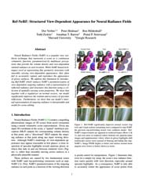

---
layout: research
title: "Layered Abstraction Technique for Effective Formal Verification of Deep Neural Networks"
intro: "This research focuses on modeling cyber-physical systems (CPS) that rely on virtual synchrony for coordination and timing accuracy. AADL (Architecture Analysis and Design Language) is used to represent the architecture and behavior of these systems. Formal analysis techniques are applied to ensure that timing constraints, communication, and synchronization requirements are met. The goal is to improve the reliability of CPS in critical applications such as aerospace or automotive systems, where precision and safety are paramount." 
bt: "Layered Abstraction Technique"
st: "for Effective Formal Verification of Deep Neural Networks"
authors: Jueun Yeon, Seunghyun Chae, Kyungmin Bae
comments: International Conference on Computer-Aided Verification, CAV 2024
img-url: "nn-panda.png"
date: 2022-12-23
---   

  

    <h2 class="col-md-12 text-center blue" id="title">
      <b>Layered Abstraction Technique</b> for Effective Formal Verification
      of Deep Neural Networks
       
      <small>
        International Conference on Computer-Aided Verification, CAV 2024
      </small>
    </h2>
  

  

    

      <table class="author-table" id="author-table">
        <tbody>
          <tr>
            <td>
              <a
                style="text-decoration: none"
                href="https://scholar.harvard.edu/dorverbin/home"
              >
                Jueun Yeon
              </a>
               POSTECH
            </td>
            <td>
              <a style="text-decoration: none" href="https://phogzone.com/">
                Seunghyun Chae
              </a>
               POSTECH
            </td>
            <td>
              <a
                style="text-decoration: none"
                href="http://bmild.github.io/"
              >
                Kyungmin Bae
              </a>
               POSTECH
            </td>
          </tr>
        </tbody>
      </table>
    

  

  

    

      <ul class="nav nav-pills nav-justified material">
        <li>
          <a href="https://arxiv.org/abs/2112.03907">
            
            <h4><strong>Paper</strong></h4>
          </a>
        </li>
        <li>
          <a href="https://youtu.be/qrdRH9irAlk">
            
            <h4><strong>Video</strong></h4>
          </a>
        </li>
        <li>
          <a
            href="https://storage.googleapis.com/gresearch/refraw360/ref.zip"
            target="_blank"
          >
            
            <h4><strong>Experiment Dataset</strong></h4>
          </a>
        </li>
        <li>
          <a
            href="https://github.com/google-research/multinerf"
            target="_blank"
          >
            
            <h4><strong>Code</strong></h4>
          </a>
        </li>
      </ul>
    

  

  

  <h3 id="abstract">Abstract</h3>

  

    Deep learning has performed well in many areas. However, deep learning
    is vulnerable to errors such as adversarial examples. Therefore, much
    research exists on ensuring the safety and robustness of deep neural
    networks. Since deep neural networks are large in scale and the
    activation functions are non-linear, linear approximation methods for
    such activation functions are proposed and widely used for verification.
    In this research, we propose a new technique, called layered
    abstraction, for non-linear activation functions, such as ReLU and Tanh,
    and the verification algorithm based on that. We have implemented our
    method by extending the existing SMT-based methods. The experimental
    evaluation showed that our tool performs better than an existing tool.
  

  

  <h3 id="main-problem">Main Problem</h3>
  

    
  

  

    A major factor in neural network verification is the presence of
    activation functions like ReLU(Rectified Linear Unit), Sigmoid, and Tanh
    that provides non-linearity to the DNN, with such non-linear nature
    making the problem NP-hard. One such solution to this is linear
    approximation (i.e. abstraction), which simplifies the verification
    problem, making the problem more manageable for large-scale neural
    networks. Various abstraction techniques has been proposed, each with
    their own trade-offs between precision and performance with
  

  <ul>
    <li>
      Increasing performance, leading to shorter verification time but
      increases the possibilities of spurious counterexamples (false
      positives)
    </li>
    <li>
      Increasing precision, leading to less wrong answers but increases the
      computation cost.
    </li>
  </ul>
  

  <h3 id="contributions">Contributions</h3>
  

    
  

  

    To mitigate above trade-offs, we propose a new abstraction technique
    called layered abstraction technique. The hierarchical technique
    provides a tiers (i.e. levels) of abstractions each with different
    degrees of precision and performance.
  

  <ol>
    <li>Level 1: highest precision &amp; lowest performance</li>
    <li>Level 2: mid precision &amp; mid performance</li>
    <li>Level 3: lowest performance &amp; highest precision</li>
  </ol>
  

    Then during the verification process, we apply the abstraction with the
    highest level first, and gradually apply lower levels of abstraction
    every time a spurious counterexample is encounted.
  

  <h2
    id="-highlight-javascript--function-sayhelloname----if-name------consoleloghello-world----else------consoleloghello-name----endhighlight-"
  >

  </h2>

  

  <h3 id="experimental-results">Experimental results</h3>
  

    In this page we will show two experimental results to demonstrate the
    capabilities of our approach. One, by comparing our approach against
    Reluplex on verifying AcasXu neural networks in terms of verification
    time. And, two by verifying AcasXu neural networks with Tanh activation
    functions, previously unverifiable.
  

  

    

      <!-- Your image here -->
      
      <h2 class="subtitle has-text-centered">
        1. Properties Verified.
      </h2>
    

    

      <!-- Your image here -->
      
      <h2 class="subtitle has-text-centered">
        2. Comparison against Reluplex.
      </h2>
    

    

      <!-- Your image here -->
      
      <h2 class="subtitle has-text-centered">
        3. Verification of Tanh NN.
      </h2>
    

  

  

  <h3 >References</h3>
  <ol>
    <li>
      J. Yeon, S. Chae, and K. Bae, Layered Abstraction Technique for
      Effective Formal Verification of Deep Neural Networks, Journal of
      KIISE, Vol. 49, No. 11, Nov 2022 [<a
        href="https://www.dbpia.co.kr/pdf/pdfView.do?nodeId=NODE11158124"
        >paper</a
      >]
    </li>
    <li>
      J. Yeon, S. Chae, and K. Bae, Layered Abstraction for Formally
      Verifying Deep Neural Networks, Korea Software Congress (KSC), Dec
      20-22, 2021 [<a
        href="https://www.dbpia.co.kr/pdf/pdfView.do?nodeId=NODE11035647"
        >paper</a
      >]
    </li>
  </ol>
  

    

  <h3 >Youtube</h3>
  

    <!-- Youtube embed code here -->
    <iframe
      src="https://www.youtube.com/embed/EBld4cqxbZQ"
      frameborder="0"
      allow="autoplay; encrypted-media"
      allowfullscreen
    ></iframe>
  

  

  <h3>BibTex</h3>
  
  <pre><code>@article{verbin2022refnerf,
        title={{Ref-NeRF}: Structured View-Dependent Appearance for
              Neural Radiance Fields},
        author={Dor Verbin and Peter Hedman and Ben Mildenhall and
                Todd Zickler and Jonathan T. Barron and Pratul P. Srinivasan},
        journal={CVPR},
        year={2022}}</code>
  </pre>
  
  

  <h3>Code</h3>
  
#include <bits/stdc++.h>
using namespace std;

int main() {
    vector<int> vec = { 1, 5, 8, 9, 6, 7, 3, 4, 2, 0 };

    // Defining the range as whole vector
      auto first = vec.begin();
      auto last = vec.end();
      
      // calling the sort for the above defined range
    sort(first, last);

    for (auto i: vec)
        cout << i << " ";
    return 0;
}
  

  <h3>Videos</h3>
  

    

      <video
        poster=""
        id="video1"
        autoplay
        controls
        muted
        loop
        width="100%"
      >
        <!-- Your video file here -->
        <source src="../videos/carousel1.mp4" type="video/mp4" />
      </video>
    

    

      <video
        poster=""
        id="video2"
        autoplay
        controls
        muted
        loop
        width="100%"
      >
        <!-- Your video file here -->
        <source src="../videos/carousel2.mp4" type="video/mp4" />
      </video>
    

    

      <video
        poster=""
        id="video3"
        autoplay
        controls
        muted
        loop
        width="100%"
      >
        \
        <!-- Your video file here -->
        <source src="../videos/carousel3.mp4" type="video/mp4" />
      </video>
    

  

