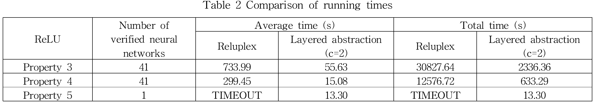

## Introduction

A concurrent system can be naturally specified as a rewrite theory (Σ,E,R). Under simple conditions, narrowing with rules R modulo the equations E can be used to both represent the system's state space by means of terms with logical variables and for model checking verification of LTL properties. Folding abstraction may approximate infinite logical reachable subsystem into a finite logical system. The Maude LTL logical model checker (LMC) tool can verify LTL properties over such logical states from a pattern of (possibly infinite) initial states using the (folded) logical state space.

Using this method, one of four outcomes is possible: (1) a fixpoint (a finite state space) is reached and the formula is fully verified; (2) no such fixpoint is reached and the formula is only verified up to a given bound; (3) a real counterexample is found and reported; or (4) a possibly spurious counterexample is found and reported.

The main feature and the usage of the Maude LMC tool are briefly described in this [tutorial](manual.pdf), where we illustrate the LMC tool using the examples [below](#resource).

### Triple Carousel Sample
This will works well in the lab page.

  

    

      <!-- Your image here -->
      
      <h2 class="subtitle has-text-centered">
        1. Properties Verified.
      </h2>
    

    

      <!-- Your image here -->
      
      <h2 class="subtitle has-text-centered">
        2. Comparison against Reluplex.
      </h2>
    

    

      <!-- Your image here -->
      
      <h2 class="subtitle has-text-centered">
        3. Verification of Tanh NN.
      </h2>
    

  

## Members
*   Jaehun Lee, POSTECH
*   Kyungmin Bae, POSTECH
*   Peter Csaba Ölveczky, University of Oslo
*   Sharon Kim, POSTECH
*   Minseok Kang, POSTECH

## References

The following paper explains approximation methods for logical model checking:

*   [Abstract Logical Model Checking of Infinite-State Systems Using Narrowing](http://dx.doi.org/10.4230/LIPIcs.RTA.2013.81), Kyungmin Bae, Santiago Escobar, José Meseguer, RTA'13, 2013

The narrowing-based symbolic model checking method is introduced in:

*   [Symbolic Model Checking of Infinite-State Systems Using Narrowing](http://dl.acm.org/citation.cfm?id=1779795), Santiago Escobar, José Meseguer, RTA'07, 2007

## Download

The Maude LMC model checker is available to download [here](http://maude.cs.illinois.edu/tools/tlr/download/).
 

## Examples

The followings are logical model checking examples using our tool.

*   [Lamport's Bakery protocol](sample.maude)
*   [Readers-Writers problem](sample.maude)
*   [Readers-Writers problem (simplified)](sample.maude)
*   [Dijkstra's mutual exclusion algorithm](sample.maude)

---

## Code
<!-- This will works well in the lab page. -->


#include <bits/stdc++.h>
using namespace std;
    int main(){
    vector<int> vec = { 1, 5,   , 9, 6, 7, 3, 4, 2, 0 };

    // Defining the range as whole vector
      auto first = vec.begin();
      auto last = vec.end();
      
      // calling the sort for the above defined range
    sort(first, last);

    for (auto i: vec)
        cout << i << " ";
    return 0;
    }


---
Last modified: 08/08/2014 02:40:42 (Kyungmin Bae)
